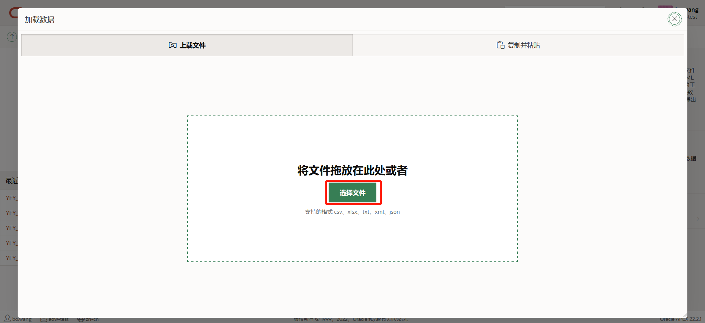

## APEX动手实验-上午 9:30 - 11:30

## Workshop 概述

本次Workshop主要以动手为主，将带您体验Apex快速生成应用的能力。另外也会介绍Apex报表交互性，使用报表的交互性可以快速将业务数据转化为各种有实际价值的信息。

在实际的工作中相信大家使用Excel的频率非常的高，值得一提的是...Apex报表可以完美的替代EXCEL表格，接下来我们一起体验Apex报表能力。

预计时间：2小时以内

## 目录

- Lab 1 - 快速生成应用

- Lab 2 - 交互式报表介绍（逐条增删改查）

- Lab 3 - 交互式网格使用（批量增删改查）

  

下记为数据文件的本次动手实验的示例数据[Data analysis.xlsx]。

****

****

### Lab 1 - 快速生成应用

#### 任务1：上传文件

点击‘SQL工作室 ->实用程序-> 数据工作室’ - (New Table 或 Existing Table)。

在数据工作室中，点击’数据加载‘。

点击’选择文件‘，选择'Data analysis.xlxs'文件。

在表名处设置目标表，填写新表名或选择现有表，配置完成后点击'数据加载'按钮。

※在此处...请大家在‘表名’处添加自己的前缀进行标识，如：XX_SALES_DATA_UPLOAD。

数据加载完成如下所示，接下来点击“创建应用程序”按钮快速生成应用。

****

#### 任务2：生成应用

在创建应用程序画面中点击‘创建应用程序’按钮。

应用程序创建中.....

应用创建成功后，如下所示，点击“运行应用程序”。

在登录画面中输入用户名/密码后点击“登录”。

画面运行后，运行结果如下所示。

提示：大家可以把APEX链接发送到自己手机上，可以试试Apex生成的画面在手机上的适配。

#### 概况

这样就完成了Lab1，您现在知道如何在Apex中快速生成应用。

***

***

### Lab 2 - 交互式报表介绍（逐条增删改查）

简介

在Apex中存在IR(交互式报表)、IG(交互式网格)和chart都可以对数据进行分析。

如：

IR、IG   →  筛选、过滤、高亮、Chart、分段控制。

Chart    →  条形图、面积图、折线图、饼图........等等等。

接下来我们一起动手，看一下Apex的图表数据分析能力。

****

#### 任务1：交互式报表(IR)

 ※交互式报表数据分析

##### ①创建交互式报表画面

选择‘交互式报表’，然后点击’下一步‘。

画面名称输入后，数据源选择Lab1-任务1中对应的表名。

画面创建成功后，如下所示，点击’运行‘。

##### ②交互式报表演示

**•Column 列**

Column 列...可以隐藏报表列，或者修改报表列的显示顺序。

**•Filter 过滤器**

Filter 过滤器...可按照一定的过滤条件过滤数据。

**•Compute 数据 -> 计算**

 计算...使用计算功能，可以添加新的计算列。

**•格式 -> 控制分段**

控制分段...可把同一类数据归类在一起显示。

**•格式 -> 突出显示**

**•Chart 图表**

**•交叉报表**

交叉报表...是行、列方向都有分组的报表。

•Primary/Private/Public report 默认主报表/专用/公共报表

保存私有报表

保存默认报表

保存公共报表

※保存公共报表前提条件 => 在编辑页中找到报表，点击属性，然后在属性中开启‘报表保存公共报表’功能。开启后即可保存公共报表。

**•Download 下载**

下载...可把报表当前显示内容下载到本地。

**•订阅**

订阅...开启订阅功能后，可按照所设置的频率（每天/每周/每月）把报表信息发送到您的邮箱。

##### ③IR-逐条增删改查

交互式报表(IR)不支持CUD。结合表单Form后才能完成编辑功能。

在应用程序编辑页中，点击“创建页”->"交互式报表"。

在“创建交互式报表”画面中打开包括表单页的开关按钮，输入页面名称后，数据源的表名选择Lab1生成的表，然后点击“下一步”。

主键列选择ID,选择完成后点击“创建页”。

页面创建成功后如下所示，点击“运行”按钮运行画面。

画面运行完成后，如下所示。

※接下来大家可以体验一下IR+FORM的增删改查。

***

#### 概况

这样就完成了Lab2，您现在知道如何在Apex中使用交互式报表。

****

****

### Lab 3 - 交互式网格使用（批量增删改查）

 ※交互式网格的数据分析和交互式报表的数据分析一致，详细请参照任务1。

##### ①创建交互式网格画面

备注：详细参照Lab2 -> 任务1 -> ①，在创建画面向导时，选择交互式网格即可。

##### ②交互式网格演示

备注：详细参照Lab2 -> 任务1 -> ②。

##### ③IG-批量增删改查

如何创建可编辑的交互式网格提示：

​          =>创建页时，选择"交互式网格"。在创建交互式网格画面中，数据源处打开“启用编辑”的开关，设置好必须入力参数后，然后再创建页。

***

#### 概况

这样就完成了Lab3，您现在知道如何在Apex中使用交互式网格。

****

****

